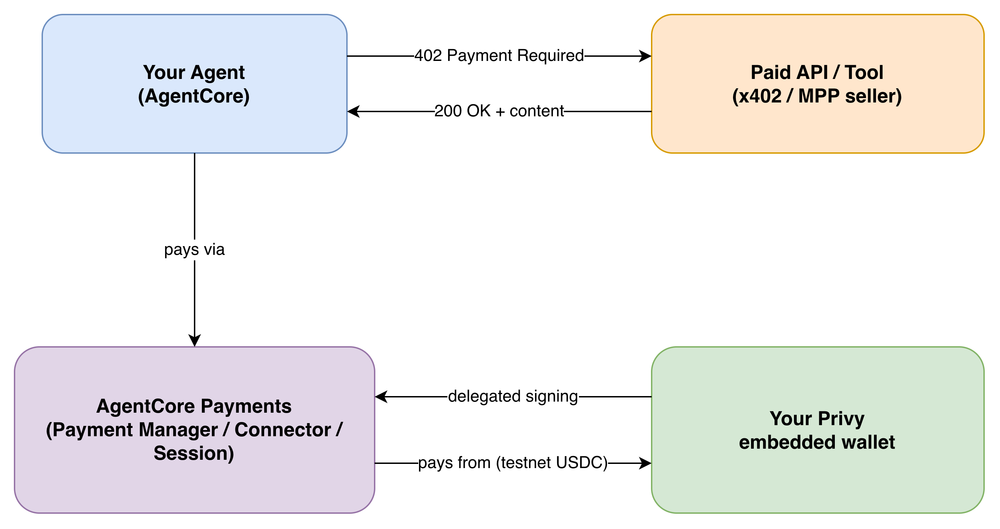

# Machine Payments Workshop: AWS + Stripe

This joint AWS and Stripe workshop walks through both sides of an autonomous machine payment.
First, you'll build and deploy an API on **AWS Lambda**, then protect it with an **HTTP 402/x402**
payment boundary backed by **Stripe machine payments**. Next, you'll build a buyer agent on
**Amazon Bedrock AgentCore** that can discover the price, pay the API, and return its protected
content without a checkout form or a human approving the payment in the moment.

The agent pays with testnet USDC from a wallet whose owner explicitly delegates signing rights,
using **Privy** (a Stripe company) as the embedded wallet provider. By the end, you will have a
complete seller-and-buyer flow running across AWS, Stripe, AgentCore Payments, and Base Sepolia.

> **No prior crypto/wallet experience assumed.** Every new concept (wallets, signers, testnets,
> the payment protocol itself) is explained inline, right where you first need it.

## What you'll build

<p align="center">
  
</p>

The workshop has two connected phases:

1. **Phase 1 — Build the seller** (Steps 1-2): deploy a free API, add the x402 paywall, and
   observe its `402 Payment Required` challenge. This phase is self-contained: you'll have a
   working paid API at the end of it, before touching any wallet or agent concepts.
2. **Phase 2 — Build the buyer** (Steps 3-10): configure a funded AgentCore/Privy wallet, delegate
   payment authority, and run an agent that pays the API automatically.

One root [`.env`](.env.example) holds every credential for both phases — copy
`.env.example` to `.env` once, at the repository root, and every script, deploy command, and the
agent itself read that same file. The one exception is `privy-frontend/` (Step 7), a separate
vendored Next.js app that needs its own `.env` because Next.js can only load environment files
from its own project root.

## Start the workshop

Begin with **[Step 1: Build and Deploy the Public API](workshop/01-public-api/README.md)**.

See the **[full workshop outline](WORKSHOP.md)** for prerequisites and every chapter.

## Repo layout

```
.
├── README.md                    <- you are here
├── WORKSHOP.md                  <- prerequisites and complete workshop outline
├── .env.example                 <- the ONE env template for the whole workshop (copy to .env)
├── diagram/                     <- editable .drawio sources + exported PNGs for the diagrams above
├── workshop/                    <- all seller API and buyer agent workshop chapters (Steps 1-11)
├── api/                         <- Lambda/API Gateway seller implementation (Steps 1-2)
├── main/                        <- one-off provisioning scripts (wallet + payment session)
├── agentcore/                   <- AgentCore project config (agentcore.json, CDK)
├── app/PaymentsAgent/           <- the agent code (Strands + AgentCore Payments plugin)
└── privy-frontend/              <- delegation/funding web app, with its own .env (Step 7)
```
