# Machine Payments Workshop: AWS Bedrock AgentCore + Stripe (Privy)

An AWS/Stripe joint workshop. You'll build an AI agent on **[Amazon Bedrock
AgentCore](https://docs.aws.amazon.com/bedrock-agentcore/)** that can **autonomously pay for
machine-to-machine (x402 / MPP) protected APIs** — no human in the loop, no credit card form. The
agent settles payment from a testnet crypto wallet that *you* delegate signing rights to, using
**[Privy](https://www.privy.io/)** (a Stripe company) as the embedded wallet provider.

By the end, your agent will hit a `402 Payment Required` response, pay for it automatically, and
return the paid content — using real (testnet) money moving on a real (testnet) blockchain.

> **No prior crypto/wallet experience assumed.** Every new concept (wallets, signers, testnets,
> the payment protocol itself) is explained inline, right where you first need it.

## What you'll build

```
┌─────────────┐   402 Payment Required    ┌───────────────────┐
│  Your Agent │ ─────────────────────────▶ │  Paid API/Tool    │
│ (AgentCore) │ ◀───────────────────────── │ (x402/MPP seller)  │
└──────┬──────┘   200 OK + content         └───────────────────┘
       │  pays via
       ▼
┌───────────────────────┐    delegated signing    ┌───────────────┐
│ AgentCore Payments     │ ◀───────────────────────│ Your Privy    │
│ (Payment Manager /     │                          │ embedded      │
│  Connector / Session)  │ ────────────────────────▶│ wallet        │
└─────────────────────────┘   pays from (testnet USDC) └─────────────┘
```

## Prerequisites

- An AWS account with access to [Amazon Bedrock AgentCore](https://docs.aws.amazon.com/bedrock-agentcore/latest/devguide/what-is-bedrock-agentcore.html), and the [AWS CLI](https://docs.aws.amazon.com/cli/latest/userguide/getting-started-install.html) installed.
- A [Privy](https://www.privy.io/) account (free) — this is where your agent's wallet infrastructure lives.
- Python 3.10+ with [`uv`](https://docs.astral.sh/uv/) for `app/PaymentsAgent/` and `main/`, and the [`agentcore` CLI](https://docs.aws.amazon.com/bedrock-agentcore/latest/devguide/getting-started-cli.html) (`pip install bedrock-agentcore-starter-toolkit` or equivalent).
- Node.js for the `privy-frontend/` app.
- A root `.env` file (see `.gitignore` — never commit this) where you'll accumulate `AWS_REGION`, `AWS_ACCESS_KEY`, `AWS_SECRET_KEY`, `END_USER_EMAIL`, `PAYMENT_MANAGER_ARN`, `CONNECTOR_ID`, `PAYMENT_USER_ID`, `PAYMENT_INSTRUMENT_ID`, and `PAYMENT_SESSION_ID` as you complete each step below.

Work through the steps in order — each one builds on the last.

---

## Step 1 — Create your Privy app & authorization key

1. Sign up at the [Privy dashboard](https://dashboard.privy.io/) and [create a new app](https://docs.privy.io/basics/get-started/quickstart).

   
   

2. Retrieve your API keys — `PRIVY_APP_ID` and `PRIVY_APP_SECRET` — from the app's **API keys** page.

   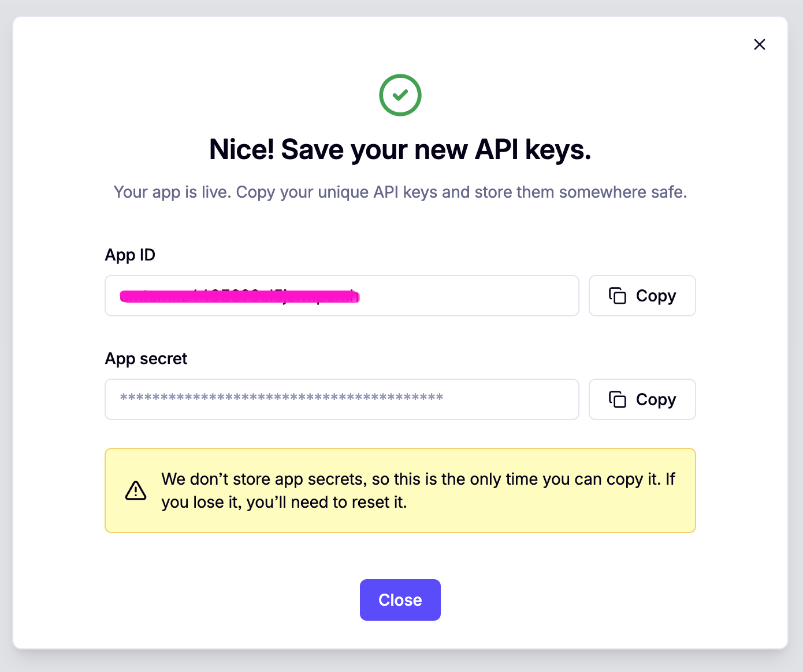

3. Generate a **Privy authorization key**. In your Privy app, go to **Wallet Infrastructure →
   [Keys and quorums](https://docs.privy.io/wallets/security/authorization-keys)** → **New Key**
   to generate a P-256 key pair. This key is what AgentCore uses to sign wallet operations on the
   agent's behalf.

   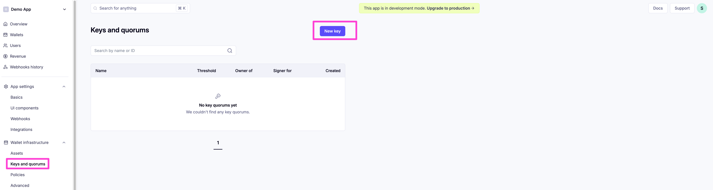
   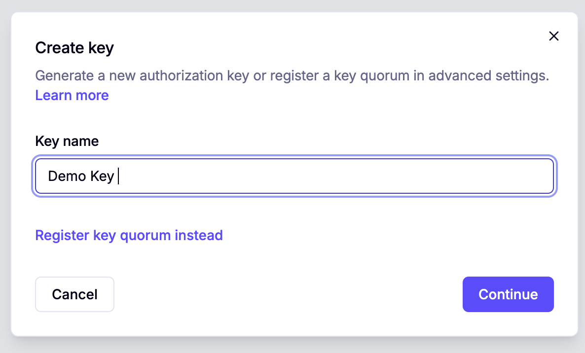

4. Note the **Authorization ID** (signer ID) shown alongside the key — this is your `PRIVY_KEY_ID`.

   

   > **Gotcha:** Privy prefixes the generated private key with `wallet-auth:`. **AgentCore
   > Payments does not accept this prefix.** Strip it and store only the raw base64 content after
   > the prefix as your `PRIVY_PRIVATE_KEY`.

---

## Step 2 — Create an AgentCore Payment Manager + Connector (AWS console)

Head to the [Bedrock AgentCore Payments console](https://console.aws.amazon.com/bedrock-agentcore/) (see the [AgentCore Payments developer guide](https://docs.aws.amazon.com/bedrock-agentcore/latest/devguide/agentcore-payments.html) for background).

1. Create a new **Payment Manager**, leaving the defaults as-is.

   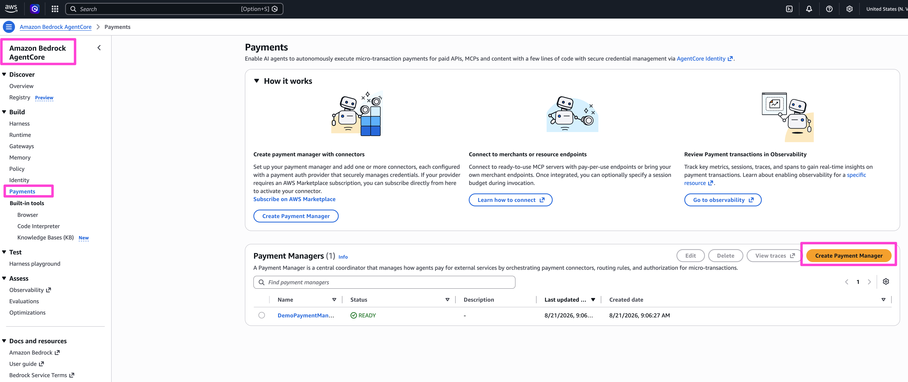
   

2. Create a new **Payment Connector** and give it a name.

   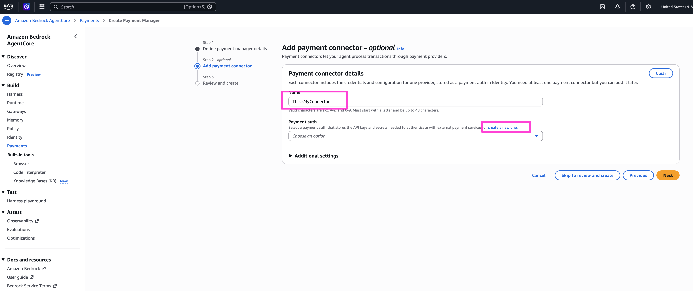

3. Create a new **payment auth**:
   - **Authorization ID** → the `PRIVY_KEY_ID` from Step 1.
   - **Authorization private key** → the stripped `PRIVY_PRIVATE_KEY` from Step 1.

   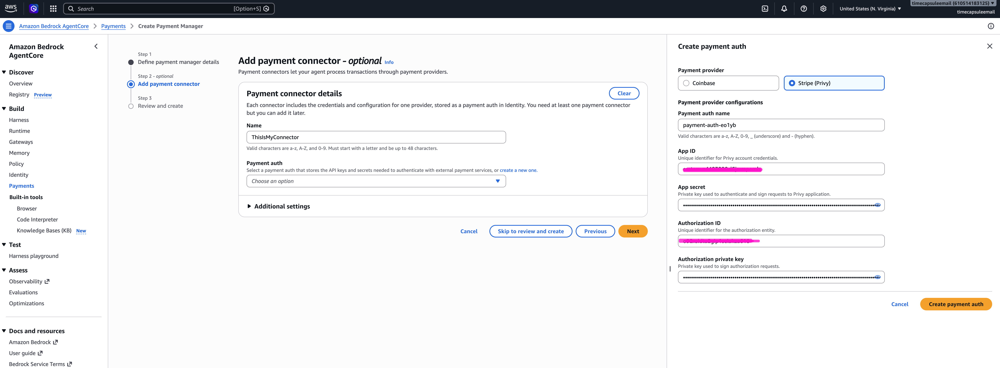

4. Review and create.

   
   

---

## Step 3 — Provision the agent's wallet

1. From the AWS console, grab the **Payment Manager ARN** and the **Connector ID** you just created.

   
   
   

2. Define an `END_USER_EMAIL` and add it, along with the ARN/Connector ID above, to your root `.env`:

   ```
   PAYMENT_MANAGER_ARN=arn:aws:bedrock-agentcore:...
   CONNECTOR_ID=...
   END_USER_EMAIL=you@example.com
   PAYMENT_USER_ID=...
   AWS_REGION=us-east-1
   AWS_ACCESS_KEY=...
   AWS_SECRET_KEY=...
   ```

3. Run the provisioning script to create the agent's embedded wallet:

   ```
   uv run main/1_create_payment_instrument_wallet.py
   ```

   Copy the printed values into `.env`:

   ```
   Payment Instrument ID: payment-instrument-xxxx
   Wallet Address: 0x123...
   ```

4. Check the [Privy dashboard](https://dashboard.privy.io/) to confirm the embedded wallet was created for the agent.

   

---

## Step 4 — Delegate signing rights via the frontend

The agent's authorization key must be added as a **signer** on the end user's embedded wallet —
and only the end user can approve that (this is the security boundary: the agent can never grant
itself wallet access).

1. In `privy-frontend/`, copy the env template and fill it in:

   ```
   cd privy-frontend
   cp .env.example .env
   ```

   Set `NEXT_PUBLIC_PRIVY_SIGNER_ID` to the `PRIVY_KEY_ID` from Step 1, and add your
   `PRIVY_APP_SECRET`.

2. Run the app and log in with your `END_USER_EMAIL`.

   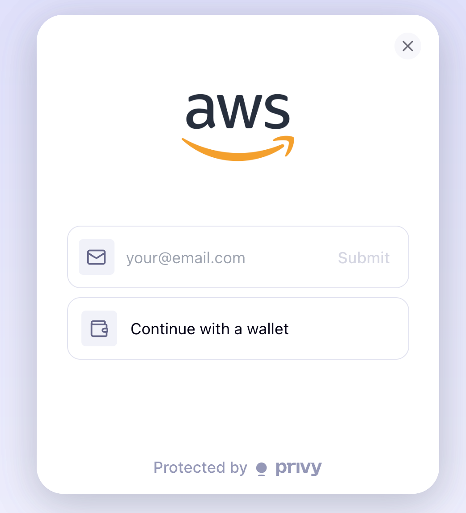
   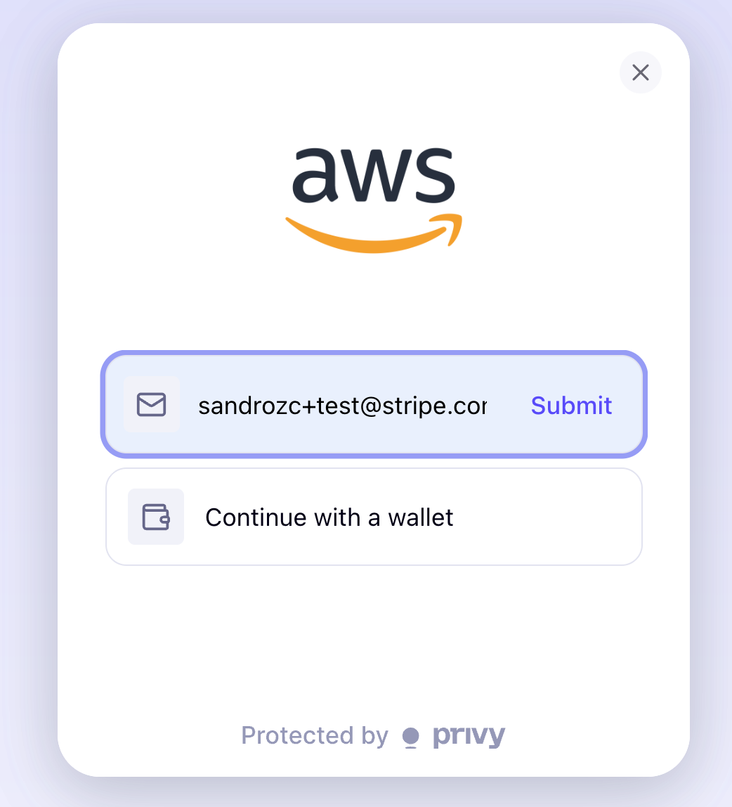
   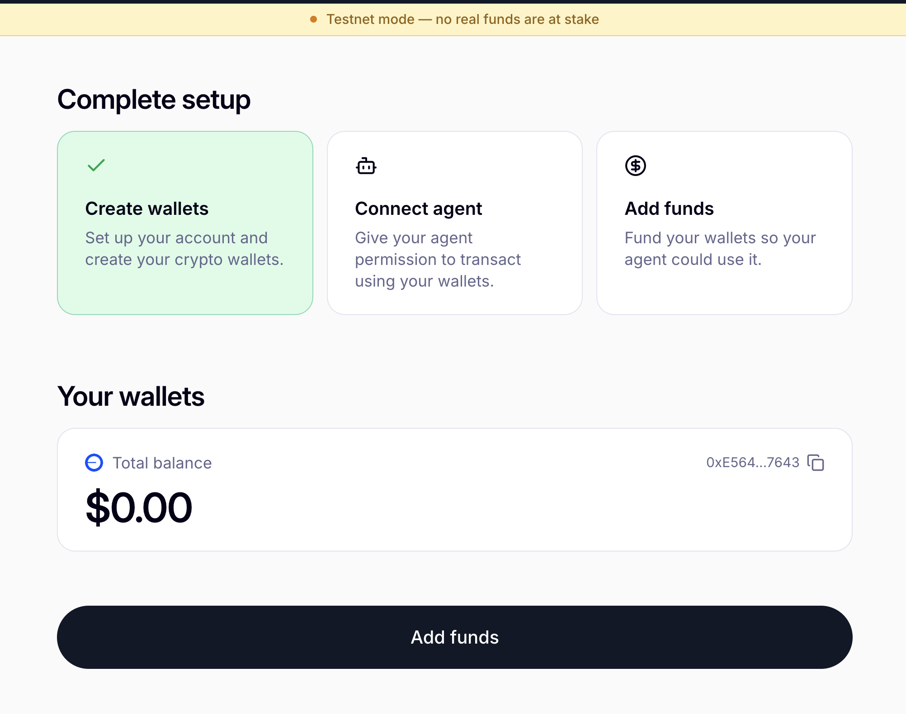

3. Click **Connect Agent** to give the agent access to the wallet.

   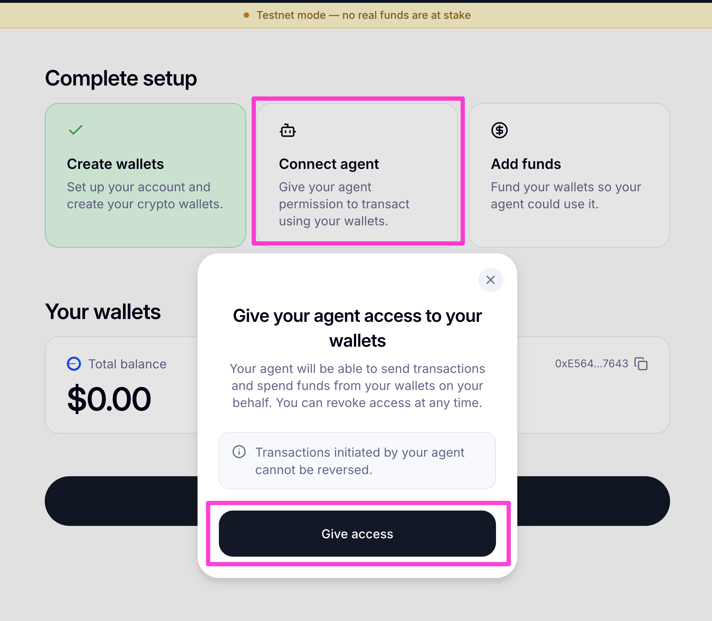
   

---

## Step 5 — Fund the wallet on testnet

1. Get free testnet USDC on **Base Sepolia** from [Circle's faucet](https://faucet.circle.com/), and send it to the wallet address shown on the Privy dashboard (the wallet created in Step 3, now delegated to the agent in Step 4).

   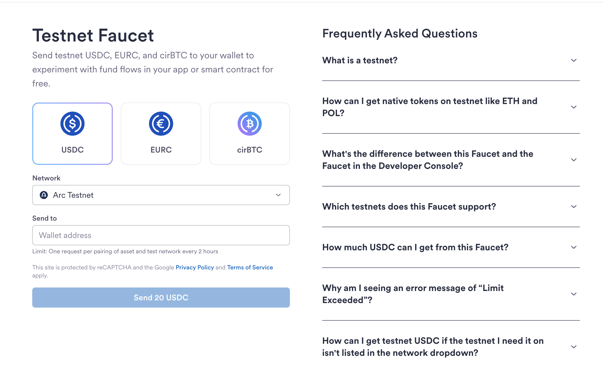
   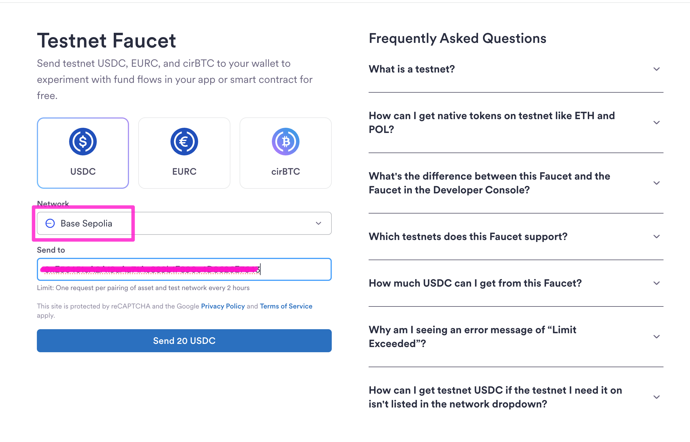
   

2. Verify the transfer landed by checking the wallet address on [Base Sepolia's block explorer](https://sepolia.basescan.org/).

   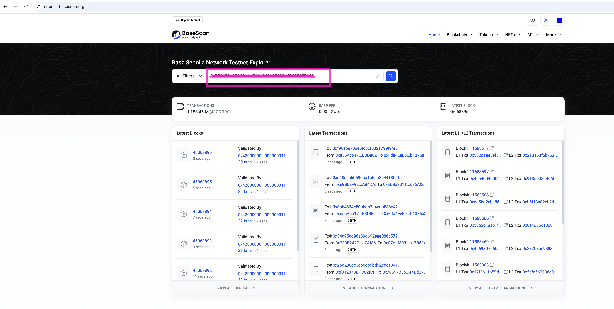
   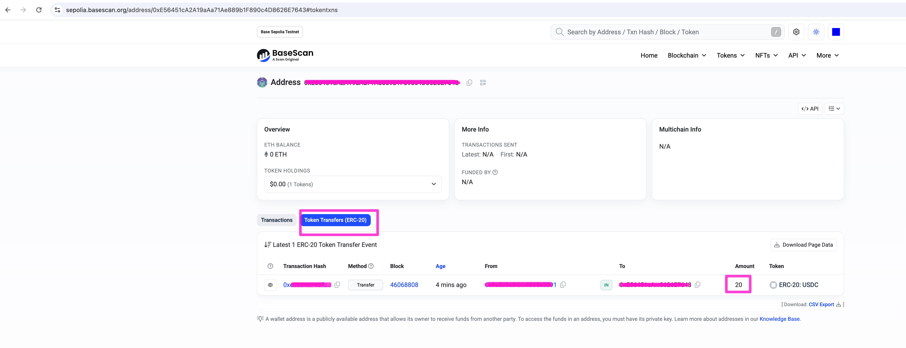

---

## Step 6 — Create a payment session

Create a time-boxed, spend-capped session that authorizes the agent to spend against the wallet:

```
uv run main/2_create_payment_session.py
```

Copy the printed value into `.env`:

```
Session ID: payment-session-xxx
```

---

## Step 7 — Run the agent and watch it pay

1. Configure a dedicated [AWS CLI profile](https://docs.aws.amazon.com/cli/latest/userguide/cli-configure-profiles.html) named `agentcore-workshop`, using the values from your root `.env`:

   ```
   aws configure set aws_access_key_id <AWS_ACCESS_KEY> --profile agentcore-workshop
   aws configure set aws_secret_access_key <AWS_SECRET_KEY> --profile agentcore-workshop
   aws configure set region <AWS_REGION> --profile agentcore-workshop
   ```

2. Point your shell at that profile and validate the project:

   ```
   export AWS_PROFILE=agentcore-workshop
   agentcore validate
   agentcore dev
   ```

   

3. Test it with this prompt (this call costs 0.002 USDC):

   ```
   Access the premium endpoint at https://sandbox.node4all.com/v1/x402-test
   ```

   

4. The agent's tool call gets a `402`, the AgentCore Payments plugin pays automatically, and the
   response comes back with a transaction hash.

   

5. Paste that transaction hash into [Base Sepolia Basescan](https://sepolia.basescan.org/) to
   confirm on-chain that your agent's wallet sent 0.002 USDC to the wallet behind the endpoint.

   

**You're done.** Your agent just discovered a paywall, paid for it with real (testnet) money, and
kept going — with no human approving the transaction.

---

## Repo layout

```
.
├── WORKSHOP.md                  <- you are here
├── README.md                    <- short project overview
├── AGENTS.md                    <- AgentCore project config reference (for AI coding assistants)
├── images/                      <- step_1 .. step_6 screenshots used above
├── main/                        <- one-off provisioning scripts (Steps 3 and 6)
├── agentcore/                   <- AgentCore project config (agentcore.json, .env.local, CDK)
├── app/PaymentsAgent/           <- the agent code (Strands + AgentCore Payments plugin)
└── privy-frontend/              <- delegation/funding web app (Step 4)
```

## Troubleshooting

- **AgentCore rejects the authorization private key** — you likely forgot to strip the
  `wallet-auth:` prefix Privy adds to the generated key (see Step 1).
- **Model access denied when running the agent** — Claude models on Bedrock require a one-time
  model-access request form; see `app/PaymentsAgent/model/load.py` for the model ID in use and
  request access to it in the [Bedrock console](https://console.aws.amazon.com/bedrock/) under
  **Model access**.
- **`ModuleNotFoundError` for `dotenv` when running the agent** — `app/PaymentsAgent/payments.py`
  needs `python-dotenv`; make sure dependencies are synced (`uv sync` in `app/PaymentsAgent/`).
- **Agent never gets past the `402`** — double check the payment session (Step 6) hasn't expired
  (default 180 minutes) or exceeded its `$5.00` spend cap, and that the wallet (Step 5) actually
  has testnet USDC.
