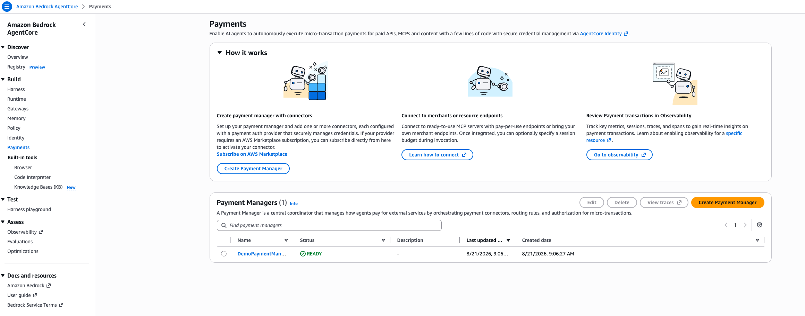
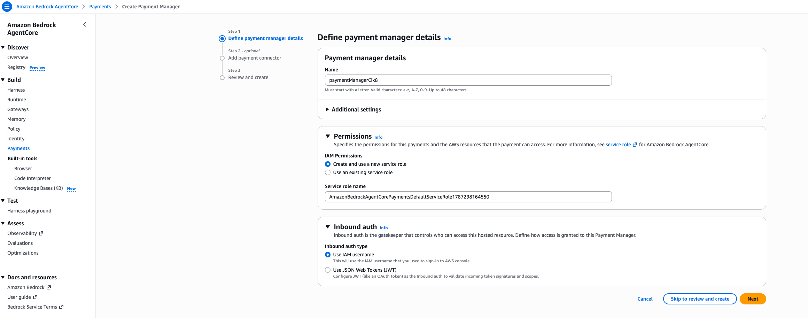
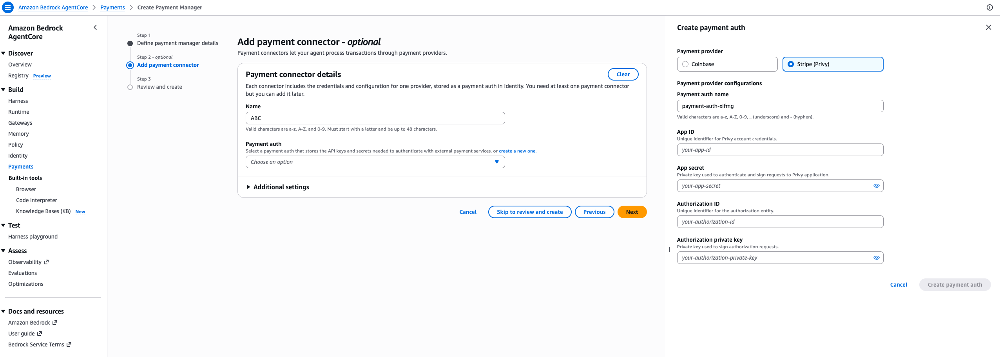

# 02 — AWS Payments Setup

In this module you'll create the AgentCore **Payment Manager** — the top-level object that
everything else in this workshop hangs off of. You'll do this in two parts, because creating the
connector (Part B) needs Privy credentials you don't have yet:

- **Part A (do now):** create the Payment Manager itself.
- **Part B (do after Module 03):** come back here to add the Stripe (Privy) connector.

## Part A — Create the Payment Manager

1. In the AWS console, go to **Amazon Bedrock AgentCore → Payments**.

   

   This page is your home base for everything payments-related — it's also where you'll come back
   later to review transactions in Observability.

2. Click **Create Payment Manager**.

3. Give it a name (letters/numbers, must start with a letter, up to 48 characters — no hyphens).

4. Under **Permissions**, leave **Create and use a new service role** selected — this creates the
   IAM role AgentCore Payments needs to operate on your behalf.

5. Under **Inbound auth**, note the option **Use IAM username**:

   

   > **Concept: Inbound auth / IAM identity**
   >
   > This setting determines *which AWS identity is allowed to call payment APIs* against this
   > Payment Manager — in this workshop's default, whichever IAM user/role your local AWS
   > credentials resolve to. This matters more than it might look: later, if your laptop's default
   > AWS CLI profile happens to be a *different* account or user than the one you used here, your
   > agent's payment calls will fail with `AccessDeniedException` even though everything else is
   > configured correctly. Keep this in mind for Module 05/07 — see
   > [Module 08](08-troubleshooting.md) if you hit it.

6. Click **Skip to review and create** (you'll add the connector in Part B, after Module 03) and
   confirm.

7. Once it's `READY`, copy its **ARN** (something like
   `arn:aws:bedrock-agentcore:us-east-1:<account-id>:payment-manager/<name>-<suffix>`) — you'll
   need it in Module 05.

Now go complete [**03-privy-dashboard-setup.md**](03-privy-dashboard-setup.md), then come back
here for Part B.

---

## Part B — Add the Stripe (Privy) connector

*(Do this after Module 03 — you'll need your Privy App ID, App secret, Authorization ID, and
Authorization private key.)*

1. Back on your Payment Manager's page, choose **Edit** (or, if you're still in the creation
   wizard, continue to **Step 2 — Add payment connector**).

2. Give the connector a name, then click **create a new one** under **Payment auth** and choose
   **Stripe (Privy)** as the provider:

   

3. Fill in the four fields from Module 03:
   - **App ID** — your Privy App ID
   - **App secret** — your Privy App secret
   - **Authorization ID** — the ID of the Authorization (signer) key you created
   - **Authorization private key** — the private key of that same signer key

4. Click **Create payment auth**, then finish the wizard.

5. Once the connector shows as active, copy its **connector ID** — you'll pass this to
   `setup_payment_user.py` in Module 05.

> **Concept: Payment Manager vs. Connector, recap**
>
> The Payment Manager you created in Part A is the control-plane object; the connector you just
> added is what tells it *how* to actually move money — in this case, via Stripe/Privy embedded
> wallets. You could add a second connector for a different provider (e.g. Coinbase) to the same
> manager later, but one connector is all this workshop needs.

## What's next

You now have a Payment Manager ARN and a connector ID. Continue to
[**04-agent-project-walkthrough.md**](04-agent-project-walkthrough.md) to tour the agent code
before wiring these values in.
