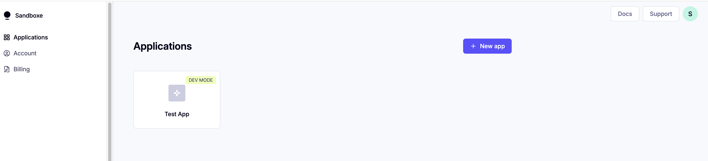
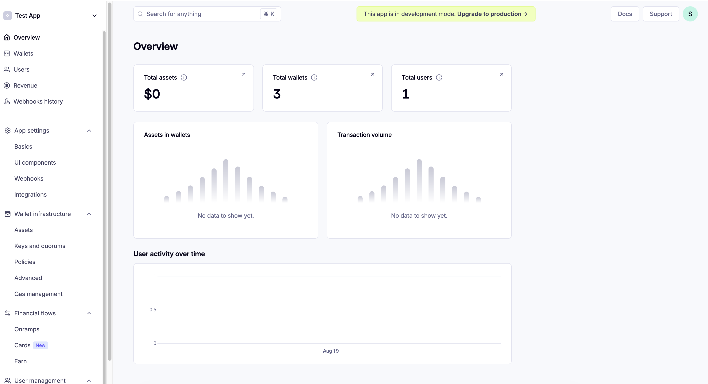
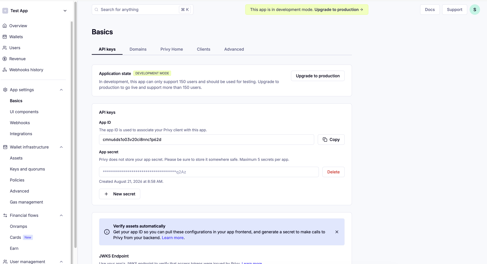
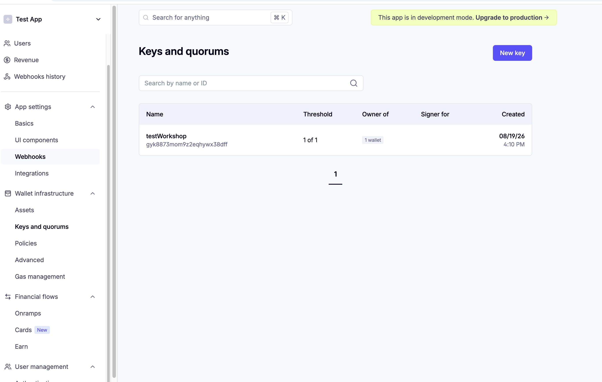
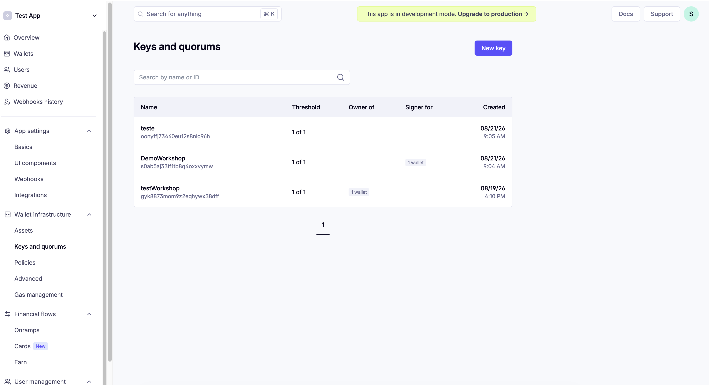

# 03 — Privy Dashboard Setup

In this module you'll create a Privy app and a signer key. You'll use the values from here in
Module 02 Part B (the AWS connector) and in `privy-frontend/.env.local` (Module 06).

## 1. Create a Privy app

1. Go to the [Privy dashboard](https://dashboard.privy.io/) and sign in.
2. Create a new application (or select an existing one for this workshop).

   

3. Open it. You'll land on the **Overview** page — total assets, wallets, and users, all zero for
   now:

   

## 2. Get your App ID and App secret

1. Go to **App settings → Basics → API keys**.

   

2. Copy the **App ID** (safe to treat as public — it's just an identifier).
3. Click **New secret** if one doesn't already exist, and copy the **App secret** immediately —
   Privy does not store it for you to retrieve later, and it should be treated like a password.

Save both somewhere safe — you'll need them for Module 02 Part B and for
`privy-frontend/.env.local` in Module 06.

## 3. Create an Authorization (signer) key

1. Go to **Wallet infrastructure → Keys and quorums**.
2. Click **New key**, give it a name (e.g. `workshop-agent`).

   

   > **Concept: Signer / delegation key, in detail**
   >
   > This key is what your *agent* uses to prove it's authorized to move funds — it is **not**
   > your own login credential, and it can't do anything until a specific wallet's owner
   > explicitly delegates to it (that happens in Module 06, when you personally click "Give
   > access"). Until then, this key can exist and be referenced, but it has no authority over any
   > wallet. This separation — a key that *can* be granted authority, versus the act of *granting*
   > it — is what makes delegation revocable and auditable: you can see exactly which keys have
   > access to which wallets, and revoke any one of them without touching the others.
   >
   > The **threshold** ("1 of 1" in the screenshot) is how many signers must approve a transaction.
   > For this workshop, one signer is enough; production setups sometimes require multiple.

3. Copy the key's **ID** (this is your "Authorization ID") and its **private key** (shown once,
   or downloadable — store it securely). Both go into Module 02 Part B.

You can see all your keys later under the same page:

## What's next

You now have everything Module 02 Part B needs. Go back to
[**02-aws-payments-setup.md**](02-aws-payments-setup.md) and complete **Part B**, then continue
to [**04-agent-project-walkthrough.md**](04-agent-project-walkthrough.md).
