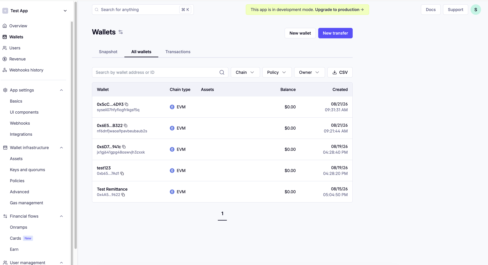

# 05 — Provision Wallet & Session

Now you'll create your own payment instrument (wallet) and session, and wire the results into the
agent's environment.

## 1. Install agent dependencies

```bash
cd app/PaymentsAgent
uv sync
```

## 2. Run the setup script

From `app/PaymentsAgent/`, run:

```bash
uv run python scripts/setup_payment_user.py \
  --user-id <your-name> \
  --email <the-email-you-will-log-into-privy-with> \
  --budget 5 \
  --manager-arn <your Payment Manager ARN from Module 02> \
  --connector-id <your connector ID from Module 02> \
  --region <your region, e.g. us-east-1>
```

> **Important:** `--email` must be the *exact* email you'll log into the Privy frontend with in
> Module 06. The wallet this script creates is linked to that email — if you log in with a
> different one later, Privy won't be able to find it (see [Module 08](08-troubleshooting.md) if
> that happens).

`--budget 5` caps this session's spending at $5 (testnet USDC, so no real money either way) —
this is the concrete enforcement of the "session" concept from Module 00.

You should see output like:

```
Instrument ID : payment-instrument-xxxxxxxxxxxxxxxxx
Wallet address: 0x...
Session ID    : payment-session-xxxxxxxxxxxxxxxx

Export these for the x402 tool (Step 8):
  export PAYMENT_MANAGER_ARN=arn:aws:bedrock-agentcore:...
  export PAYMENT_INSTRUMENT_ID=payment-instrument-xxxxxxxxxxxxxxxxx
  export PAYMENT_SESSION_ID=payment-session-xxxxxxxxxxxxxxxx
  export PAYMENT_USER_ID=<your-name>
  export AWS_REGION=<your-region>

One-time per wallet:
  1. Delegation (Privy): approve delegation via the Privy frontend SDK
  2. Funding: send testnet USDC to 0x... via https://faucet.circle.com/ (Base Sepolia)
```

Keep this terminal output visible — you'll need the wallet address and the export values in the
next two steps.

Your new wallet also shows up in the Privy dashboard under **Wallets → All wallets** (alongside
any others you've created):



It'll show a $0.00 balance for now — you'll fund it in the next module.

## 3. Fill in `agentcore/.env.local`

From the repo root:

```bash
cp agentcore/.env.local.example agentcore/.env.local
```

Open `agentcore/.env.local` and fill in the five values from the script's output, plus your AWS
credentials:

```
PAYMENT_MANAGER_ARN=<from the script output>
PAYMENT_INSTRUMENT_ID=<from the script output>
PAYMENT_SESSION_ID=<from the script output>
PAYMENT_USER_ID=<from the script output>
AWS_REGION=<from the script output>
AWS_ACCESS_KEY_ID=<your AWS access key>
AWS_SECRET_ACCESS_KEY=<your AWS secret key>
```

> **Why set `AWS_ACCESS_KEY_ID`/`AWS_SECRET_ACCESS_KEY` explicitly?** `agentcore dev` (Module 07)
> uses boto3's default AWS credential chain unless told otherwise. If your machine's default AWS
> profile is a *different* identity than the one that owns your Payment Manager (very common if
> you use AWS for other work too), payment calls will fail with `AccessDeniedException` even
> though everything else is correct — this ties directly back to the "inbound auth / IAM
> identity" concept from Module 02. Setting these two variables here pins the dev server to the
> right identity. See [Module 08](08-troubleshooting.md) for the exact symptom if you skip this.

`agentcore/.env.local` is gitignored — it will never end up in version control.

## What's next

Continue to [**06-frontend-delegation-and-funding.md**](06-frontend-delegation-and-funding.md) to
delegate signing rights to your agent and fund the wallet.
