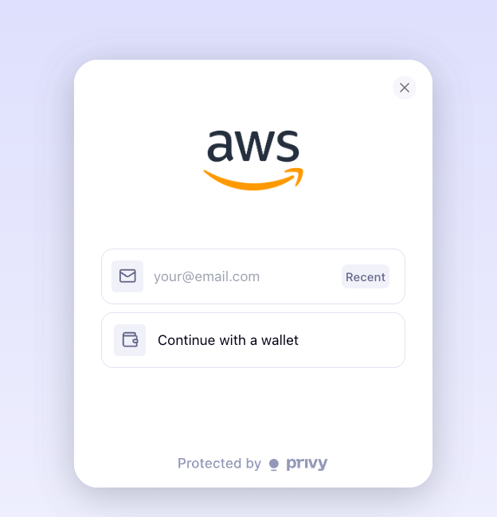
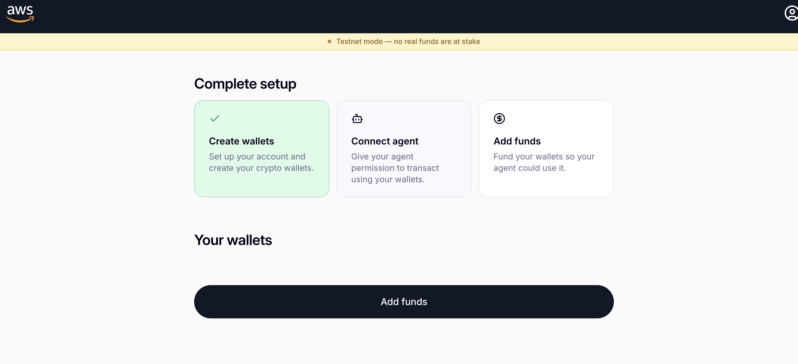
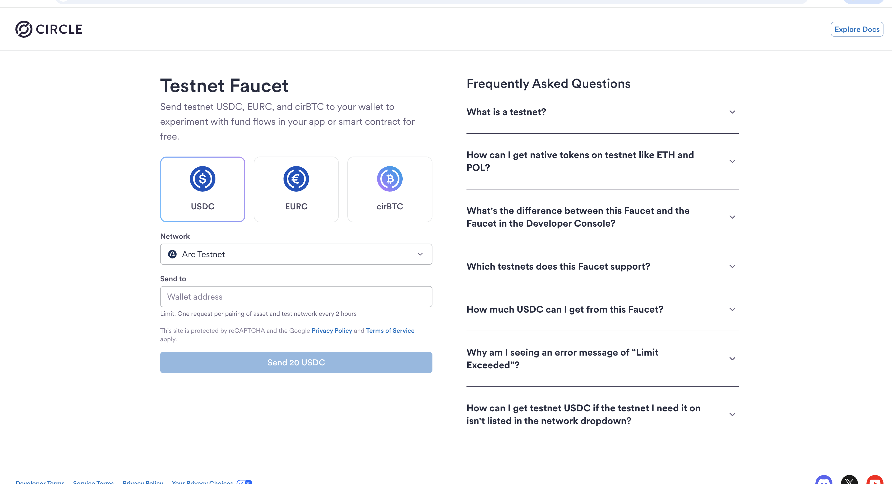
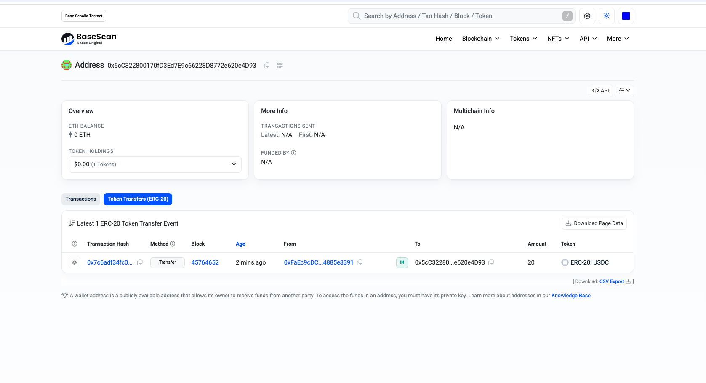

# 06 — Frontend Delegation & Funding

Your wallet exists but can't do anything yet — nothing has told it your agent is allowed to spend
from it, and it has no funds. Both happen here, through a small web app.

## 1. Set up and run the frontend

```bash
cd privy-frontend
cp .env.example .env.local
```

Fill in `.env.local` with the values from Module 03:

```
NEXT_PUBLIC_PRIVY_APP_ID=<your Privy App ID>
PRIVY_APP_SECRET=<your Privy App secret>
NEXT_PUBLIC_PRIVY_SIGNER_ID=<your Authorization key ID>
NEXT_PUBLIC_NETWORK_MODE=testnet
```

> **Concept: testnet vs. mainnet, applied**
>
> `NEXT_PUBLIC_NETWORK_MODE=testnet` is what points this app at **Base Sepolia** (a free,
> practice version of the Base blockchain) instead of Base mainnet. It also disables card-based
> funding, since Stripe's card-to-crypto onramp only deals in real mainnet USDC — on testnet,
> you'll use a faucet instead (step 3 below). Nothing you do in this workshop touches real money.

Then install and run:

```bash
pnpm install
pnpm dev
```

Open **http://localhost:3000**.

## 2. Log in and delegate

You'll see a login screen:



Log in with **the exact same email** you passed as `--email` to `setup_payment_user.py` in
Module 05.

> **Troubleshooting:** If a browser session was already logged in as someone/something else, log
> out first. Logging in with a *different* email than the one used in Module 05 creates or shows
> a different (empty) wallet, and the delegation step below will fail with "No wallets found" —
> see [Module 08](08-troubleshooting.md).

Once logged in, you'll see a setup tracker:



Click **Connect agent** → **Give access**. This is the actual delegation step:

> **Concept: delegation, in action**
>
> Clicking "Give access" grants the Authorization key you created in Module 03 permission to sign
> transactions from *this* wallet. Nothing before this point could actually move funds — this
> click is the one moment where you, the wallet's owner, explicitly authorize your agent's signer.
> You can revoke this at any time from the Privy dashboard.

## 3. Fund the wallet

Copy your wallet address (shown in the frontend, and printed by `setup_payment_user.py` in
Module 05), then go to the [Circle testnet faucet](https://faucet.circle.com/):



Select **USDC**, choose the **Base Sepolia** network, paste your wallet address, and request
funds. You'll get a small amount of free testnet USDC — enough for many x402 test payments.

## 4. Verify funding

> **Troubleshooting: the Privy dashboard may show $0 here — that's expected on testnet.**
> Privy's dashboard balance/activity view is tuned for mainnet and often doesn't reflect testnet
> transfers promptly (or at all). Don't rely on it for verification — use a block explorer
> instead, which reads directly from the chain.

Go to [Base Sepolia BaseScan](https://sepolia.basescan.org/) and search your wallet address. You
should see the incoming USDC transfer:



If you see the transfer here, your wallet is funded and ready — regardless of what the Privy
dashboard shows.

## What's next

Continue to [**07-run-and-test-the-agent.md**](07-run-and-test-the-agent.md) to run the agent and
watch it pay for something.
