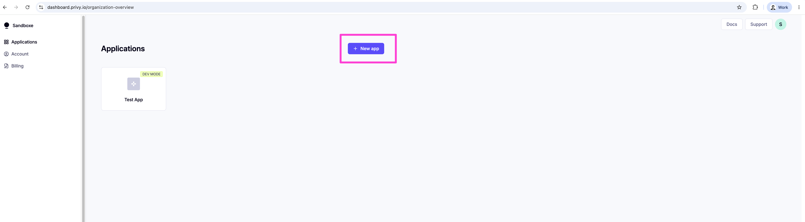
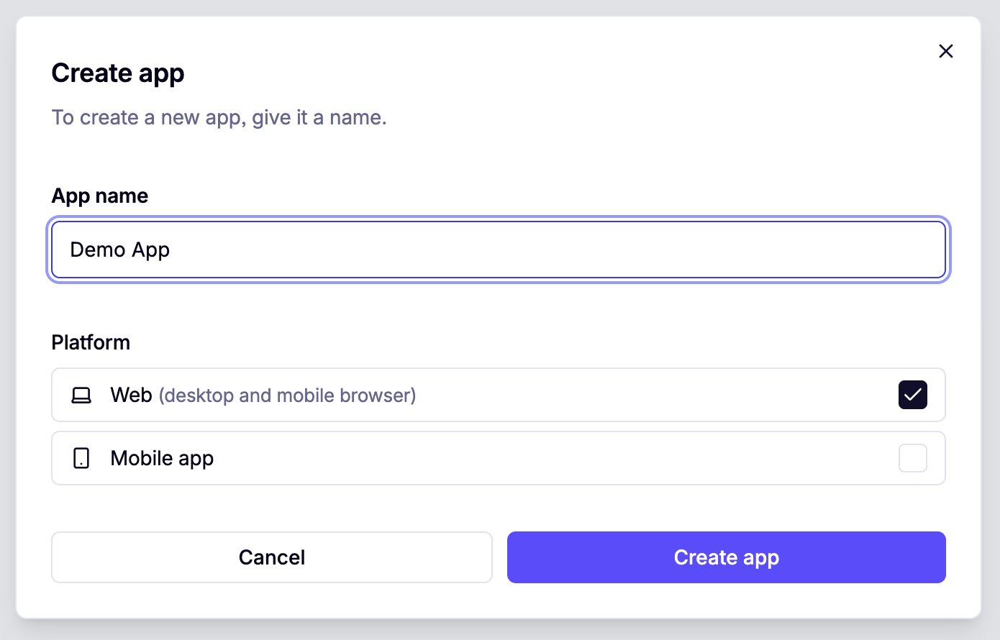
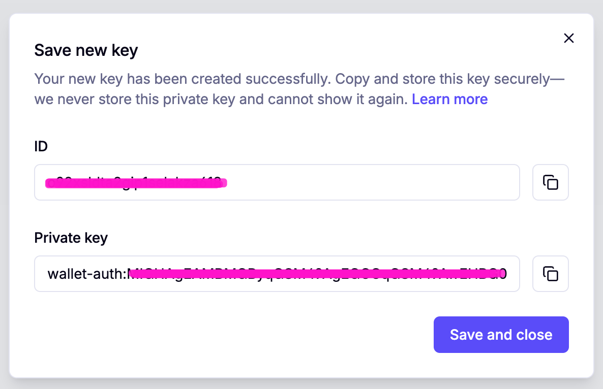

[← Concepts](../00-concepts/README.md) · [Workshop overview](../../WORKSHOP.md) · [Next: Step 2 — AgentCore Payment Manager →](../02-agentcore-payment-manager/README.md)

# Step 1 — Create your Privy app & authorization key

**Goal of this step:** end up with four values — `PRIVY_APP_ID`, `PRIVY_APP_SECRET`,
`PRIVY_KEY_ID`, and `PRIVY_PRIVATE_KEY` — saved in your root `.env`. AgentCore needs all four to
create the payment connector in Step 2.

Privy is where the actual wallet infrastructure lives. AWS never talks to Privy's dashboard or SDK
directly; it authenticates using the credentials you generate here.

## 1.1 Create a dedicated Privy app

Sign up at the [Privy dashboard](https://dashboard.privy.io/) and create a new app. Use a
**dedicated** app for this workshop rather than reusing one that serves another product — it keeps
credential scope (and any later auditing) clean.

<p align="center">
  
</p>

<p align="center"><em>Give it a name and leave the platform as "Web" — this app only needs to issue API credentials, not render Privy's login UI itself.</em></p>

Once created, Privy shows your keys exactly once.

<p align="center">
  
</p>

## 1.2 Retrieve your API keys

From the app's **API keys** page, copy the **App ID** and **App secret**. These map directly to
`PRIVY_APP_ID` and `PRIVY_APP_SECRET` in your `.env`.

<p align="center">
  
</p>

> **Save the App secret now.** Privy does not store it after creation — if you lose it, you'll
> need to reset it and update every place it's referenced.

## 1.3 Generate a Privy authorization key

Payments need a second, separate credential: a **signer key** that AgentCore uses to sign wallet
operations on the agent's behalf. This is not the same thing as your API keys above — API keys
authenticate *calls to Privy's API*; the authorization key is what actually authorizes *wallet
signatures*.

In your Privy app, go to **Wallet Infrastructure → Keys and quorums**.

<p align="center">
   Keys and quorums page">
</p>

Click **New Key** to generate a P-256 key pair.

<p align="center">
  
</p>

## 1.4 Note the Authorization ID and private key

Once created, Privy shows the key's credentials: the **Authorization ID** (this is your
`PRIVY_KEY_ID`) and the **private key** (this becomes your `PRIVY_PRIVATE_KEY`, after one edit —
see the warning below).

<p align="center">
  
</p>

> **Gotcha — strip the `wallet-auth:` prefix.** Privy prefixes the generated private key with
> `wallet-auth:`. AgentCore Payments does **not** accept this prefix — store only the raw base64
> content that follows it.
>
> ```
> Privy gives you:  wallet-auth:MIGHAgEAMBMGByqGSM49AgEGCCqGSM49AwEHBG0wawIBAQQg...
> Store only:                   MIGHAgEAMBMGByqGSM49AgEGCCqGSM49AwEHBG0wawIBAQQg...
> ```

## 1.5 Save everything to `.env`

Copy `.env.example` to `.env` at the repo root if you haven't already, and fill in:

```
PRIVY_APP_ID=...
PRIVY_APP_SECRET=...
PRIVY_KEY_ID=...
PRIVY_PRIVATE_KEY=...        # wallet-auth: prefix stripped
```

Treat these four values like passwords: they belong only in `.env` (which is git-ignored), never
committed, pasted into chat, or hardcoded in agent source.

---

Continue to **[Step 2 — Create an AgentCore Payment Manager + Connector](../02-agentcore-payment-manager/README.md)**.
