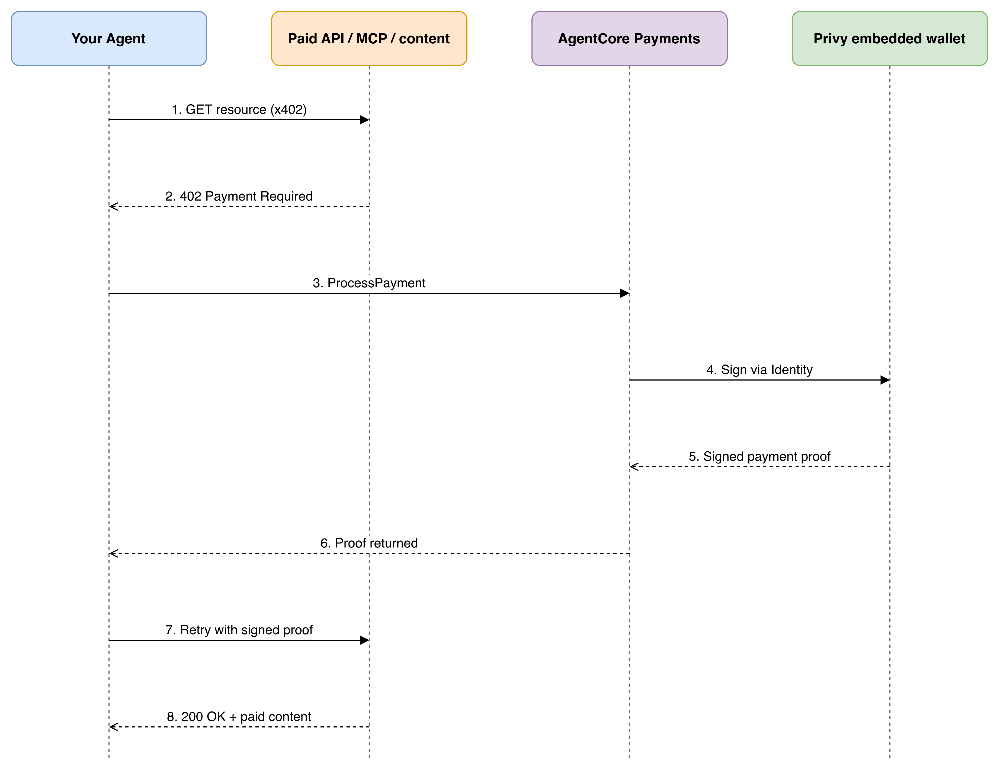

[← Step 2: Add the HTTP 402 Paid API](../02-paid-api/README.md) · [Workshop Overview](../../WORKSHOP.md) · [Next: Step 4: Create Your Privy App & Authorization Key →](../04-privy-app-setup/README.md)

# Step 3: Understand AgentCore Payments and Privy

Read this before touching any console or terminal. Every later step refers back to the resources
and vocabulary introduced here.

## The problem this solves

AI agents increasingly call paid APIs, MCP servers, and paywalled content. Providers are starting
to monetize per-request, using the HTTP `402 Payment Required` status code, but individual
requests are often worth fractions of a cent, far below what a credit card network can process
economically. [Amazon Bedrock AgentCore Payments](https://docs.aws.amazon.com/bedrock-agentcore/latest/devguide/payments.html)
is AWS's managed answer to that problem: it lets an agent settle these *microtransactions*
autonomously, in stablecoin, over an open protocol (**x402** / the **Machine Payments Protocol,
MPP**), while a developer-configured budget keeps spending bounded.

AgentCore Payments does not hold funds itself. It orchestrates a **wallet provider**, in this
workshop [Privy](https://www.privy.io/) (a Stripe company), which holds the actual **embedded
crypto wallet** on behalf of your end user. AgentCore's job is to own the payment *lifecycle*:
storing provider credentials safely, enforcing per-session spend limits, requesting a signature
from the wallet provider, and returning a payment proof the agent can hand back to the merchant.

## Who owns what

This is the one idea worth internalizing before Step 4: **the wallet belongs to your end user, not
to the agent or to AWS.** AgentCore is only ever an *authorized signer* on that wallet, and only
after the user explicitly delegates that authority (Step 7). The user can revoke it, and can
withdraw funds, at any time. This is why the workshop has a dedicated frontend step: signing that
delegation is not something an API call can do on the user's behalf.

## The five resources you'll create

| Resource | Created in | Purpose |
|---|---|---|
| **PaymentCredentialProvider** | AWS console, Step 5 | Stores your Privy `App ID` / `App Secret` / authorization key inside [AgentCore Identity](https://docs.aws.amazon.com/bedrock-agentcore/latest/devguide/identity.html) (backed by AWS Secrets Manager). The agent runtime never reads these directly. |
| **PaymentManager** | AWS console, Step 5 | The top-level coordinator for your account. Defines how callers authenticate to it (`AWS_IAM` or `CUSTOM_JWT`) and which IAM role AgentCore assumes to do payment work. |
| **PaymentConnector** | AWS console, Step 5 | Binds the PaymentManager to a specific provider: here, a `StripePrivy` connector referencing the credential provider above. |
| **PaymentInstrument** | `main/1_create_payment_instrument_wallet.py`, Step 6 | The end user's wallet. Created via AgentCore's `CreatePaymentInstrument` API (type `EMBEDDED_CRYPTO_WALLET`), **not** through the Privy SDK directly. AgentCore provisions the underlying Privy embedded wallet and hands back its address. |
| **PaymentSession** | `main/2_create_payment_session.py`, Step 9 | A time-boxed spending context (`maxSpendAmount`, `currency`, `expiryTimeInMinutes`). Once it expires or its limit is hit, AgentCore denies further payments in that session; no signing is even attempted. |

At runtime there's a sixth moving part, an API call rather than a standing resource:
**`ProcessPayment`**, the call the agent's tooling makes every time it hits a `402`. AgentCore
checks the session's remaining budget, asks Privy to sign, and returns the proof.

## The runtime flow

  

In this workshop, runtime steps 1-4 above happen automatically inside the `AgentCorePaymentsPlugin`
wired into `app/PaymentsAgent/payments.py`; you'll never call `ProcessPayment` yourself. Your job
across Steps 4-9 is entirely provisioning: get the five resources above into existence and into
your root `.env`, so that plugin has something to call against.

## Why this needs its own AWS *and* Privy setup

Two providers, two jobs:

- **AWS Bedrock AgentCore** hosts and runs your agent, and owns the payment orchestration:
  budgets, sessions, credential storage, observability.
- **Privy** owns the wallet infrastructure: key generation, embedded wallet creation, and the
  end-user consent flow that grants AgentCore signing rights.

You'll set up Privy first (Step 4), because AgentCore's payment connector needs Privy credentials
to exist before it can be created (Step 5).

---

Continue to **[Step 4: Create Your Privy App & Authorization Key](../04-privy-app-setup/README.md)**.
