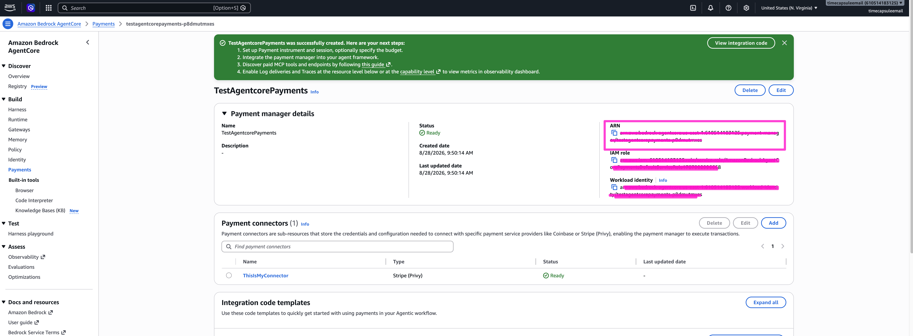
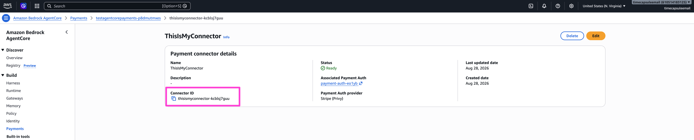
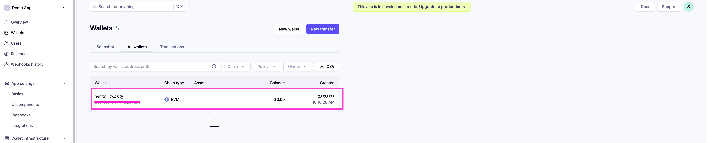

[← Step 2: Payment Manager + Connector](../02-agentcore-payment-manager/README.md) · [Workshop overview](../../WORKSHOP.md) · [Next: Step 4: Delegate signing →](../04-delegate-signing/README.md)

# Step 3: Provision the agent's wallet

**Goal of this step:** create the **PaymentInstrument** (the end user's embedded wallet) and
confirm it exists in Privy.

A new instrument starts with **0 USDC** and the agent has **no permission to spend from it yet**.
This step only creates the wallet; funding (Step 5) and delegating signing rights (Step 4) come
after.

## 3.1 Collect the Payment Manager ARN and Connector ID

Back in the AWS console, open the Payment Manager you created in Step 2 and copy its ARN.

<p align="center">
  
</p>

Then open the connector you created alongside it.

<p align="center">
  
</p>

Copy its Connector ID as well.

<p align="center">
  
</p>

## 3.2 Fill in `.env`

Define an `END_USER_EMAIL`: this is the email address of the person who will own the wallet and
approve delegation in Step 4. Add it, along with the ARN and Connector ID above, to your root
`.env`:

```
PAYMENT_MANAGER_ARN=arn:aws:bedrock-agentcore:...
CONNECTOR_ID=...
END_USER_EMAIL=you@example.com
PAYMENT_USER_ID=agentcore-user
AWS_REGION=us-east-1
AWS_ACCESS_KEY=...
AWS_SECRET_KEY=...
```

`AWS_ACCESS_KEY` / `AWS_SECRET_KEY` should belong to an IAM principal with permission to call the
AgentCore Payments data-plane APIs (`CreatePaymentInstrument`, `CreatePaymentSession`,
`ProcessPayment`), the same credentials referenced throughout this workshop's `.env` files.

## 3.3 Create the wallet

Run the provisioning script from the repo root:

```bash
uv run main/1_create_payment_instrument_wallet.py
```

This script ([`main/1_create_payment_instrument_wallet.py`](../../main/1_create_payment_instrument_wallet.py))
calls AgentCore's `create_payment_instrument` API directly via `boto3`, requesting an
`EMBEDDED_CRYPTO_WALLET` on the `ETHEREUM` network family (which covers both Base and Base
Sepolia) and linking it to `END_USER_EMAIL`. Note that this creates the wallet **through
AgentCore**, not through Privy's SDK: AgentCore provisions the underlying Privy embedded wallet
for you and hands back its address.

It prints two values; copy both into `.env`:

```
Payment Instrument ID: payment-instrument-xxxx
Wallet Address: 0x123...
```

## 3.4 Verify the wallet exists in Privy

Head back to the [Privy dashboard](https://dashboard.privy.io/) and confirm the embedded wallet
was created for the agent's linked account.

<p align="center">
  
</p>

At this point the wallet exists and holds 0 USDC, but the agent still cannot spend from it. That
requires the end user's explicit delegation, which is Step 4.

---

Continue to **[Step 4: Delegate signing rights via the frontend](../04-delegate-signing/README.md)**.
