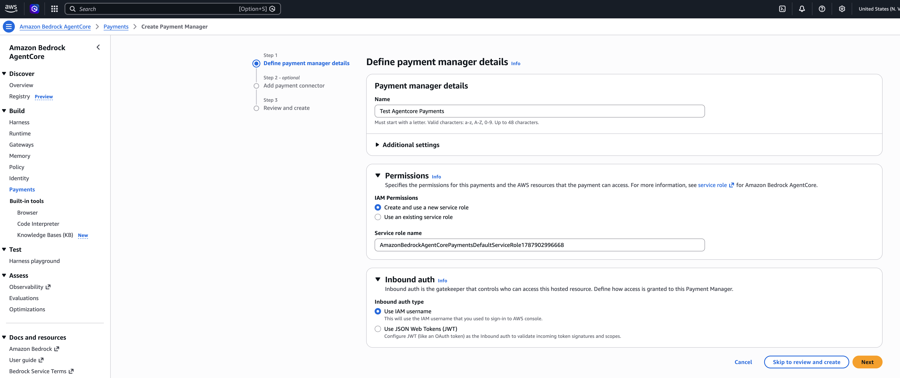
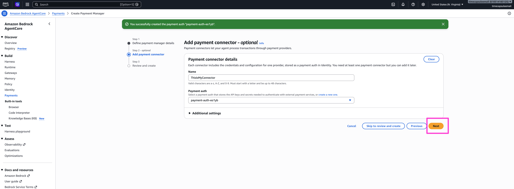
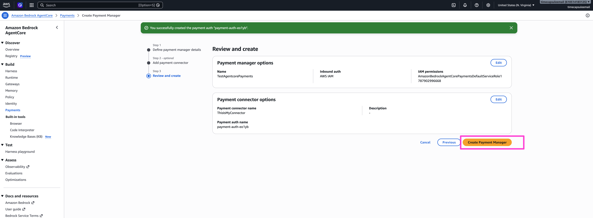

[← Step 3: Create Your Privy App & Authorization Key](../03-privy-app-setup/README.md) · [Workshop Overview](../../WORKSHOP.md) · [Next: Step 5: Provision the Agent's Wallet →](../05-provision-wallet/README.md)

# Step 4: Create an AgentCore Payment Manager + Connector

**Goal of this step:** create the AWS-side resources, a **Payment Manager**, a **Payment
Connector**, and a **payment auth**, that let AgentCore talk to the Privy app you just set up.

This all happens in the [Bedrock AgentCore Payments console](https://console.aws.amazon.com/bedrock-agentcore/).
See the [AgentCore Payments developer guide](https://docs.aws.amazon.com/bedrock-agentcore/latest/devguide/payments.html)
for the full service reference. As a refresher on the vocabulary here, see
[Step 2: Concepts](../02-concepts/README.md#the-five-resources-youll-create).

## 4.1 Create a Payment Manager

Open **Amazon Bedrock AgentCore → Payments** in the console and click **Create Payment Manager**.
Leave the defaults as-is: the default permissions setup creates a new service role scoped to
payments, which is what you want for a workshop environment.

  

The manager needs a name and an IAM role it will assume to do payment work. Unless you already
have a role you want to reuse, let the console create one for you.

  

## 4.2 Create a Payment Connector

A Payment Manager can hold multiple connectors, one per wallet provider. Add one and give it a
name (this is arbitrary, but pick something you'll recognize later; the example below uses
`ThisIsMyConnector`).

  

## 4.3 Create a payment auth

The connector needs a **payment auth**, the credential set it will use to talk to Privy. Create a
new one using the values from [Step 3](../03-privy-app-setup/README.md):

- **Authorization ID** → the `PRIVY_KEY_ID` from Step 3.
- **Authorization private key** → the stripped `PRIVY_PRIVATE_KEY` from Step 3.

  

Behind the scenes, this auth becomes a `PaymentCredentialProvider` stored in
[AgentCore Identity](https://docs.aws.amazon.com/bedrock-agentcore/latest/devguide/identity.html),
backed by AWS Secrets Manager, the same isolation Amazon uses for other credential types in
AgentCore. Your agent's runtime never sees the raw key; it only ever calls `ProcessPayment` and
gets back a signed proof.

## 4.4 Review and create

Confirm the summary and create the manager. AWS provisions the manager, connector, and credential
provider together.

  

Once it finishes, the manager shows a **READY** status.

  

## What you'll need in Step 5

Before moving on, note two values from this manager's detail page. You'll paste both into
`.env` at the start of the next step:

- The **Payment Manager ARN**
- The **Connector ID**

---

Continue to **[Step 5: Provision the Agent's Wallet](../05-provision-wallet/README.md)**.
