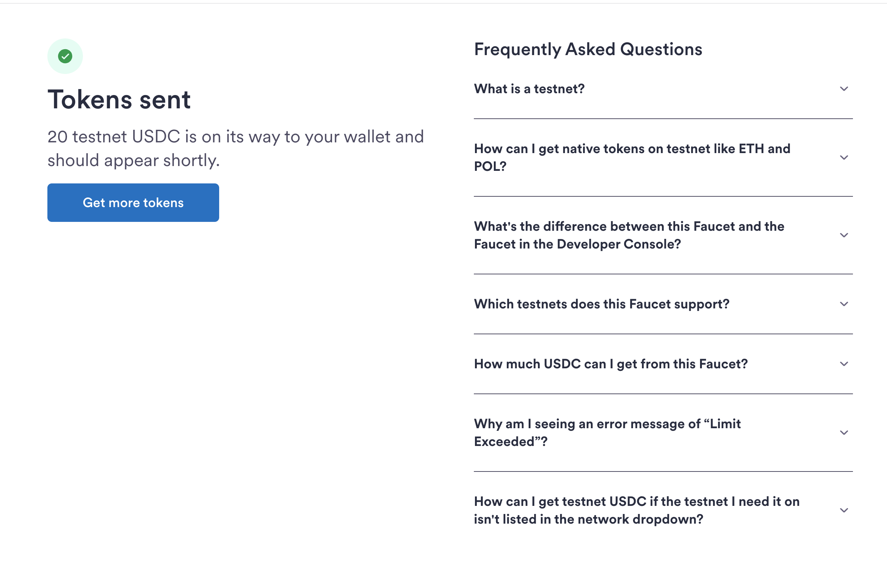

[← Step 4: Delegate signing](../04-delegate-signing/README.md) · [Workshop overview](../../WORKSHOP.md) · [Next: Step 6: Create a payment session →](../06-payment-session/README.md)

# Step 5: Fund the wallet on testnet

**Goal of this step:** put testnet USDC into the wallet so there's something for the agent to
spend in Step 7.

This workshop runs entirely on **Base Sepolia**, a public Ethereum L2 testnet. Nothing here moves
real money; see [supported networks](../08-reference/README.md#supported-networks) in the
reference section for the mainnet equivalents if you later move this into production.

## 5.1 Get testnet USDC from Circle's faucet

Go to [Circle's USDC faucet](https://faucet.circle.com/), select **Base Sepolia**, and paste in
the wallet address from [Step 3](../03-provision-wallet/README.md) (the same address visible on
the Privy dashboard from Step 4).

  

Request funds; the faucet drips a small, fixed amount of free testnet USDC.

  

  

## 5.2 Verify the transfer on-chain

Open [Base Sepolia's block explorer](https://sepolia.basescan.org/) and search for the wallet
address.

  

Confirm the USDC balance reflects the faucet transfer before moving on. If it's still zero, wait
a few seconds and refresh; Base Sepolia confirmations are typically fast but not instant.

  

---

Continue to **[Step 6: Create a payment session](../06-payment-session/README.md)**.
