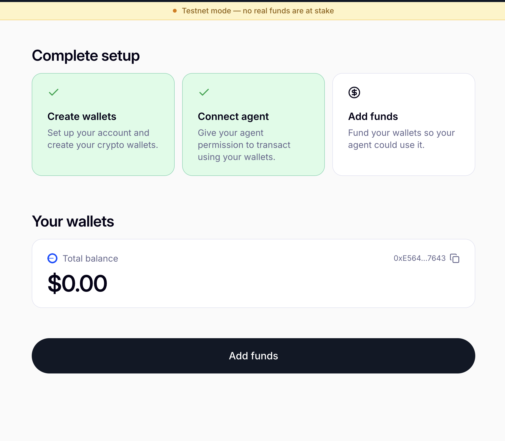

[← Step 6: Provision the Agent's Wallet](../06-provision-wallet/README.md) · [Workshop Overview](../README.md) · [Next: Step 8: Fund the Wallet on Testnet →](../08-fund-wallet/README.md)

# Step 7: Delegate signing rights via the frontend

**Goal of this step:** have the end user log in and explicitly grant the agent's authorization
key signing rights on their wallet.

This is the step that can't be automated away, by design. The wallet belongs to the end user (see
[Step 3: who owns what](../03-concepts/README.md#who-owns-what)), so only that user, logged in
as themselves, can approve adding a new signer. If this step is skipped, `ProcessPayment` will
fail later with a "Delegation not completed" error; there's no API AgentCore or this workshop can
call to force it through.

We use the reference frontend from the
[Privy AgentCore SDK](https://github.com/privy-io/aws-agentcore-sdk), vendored into this repo
under `privy-frontend/`, which provides a small wallet hub for login, agent delegation, and
funding.

## 6.1 Configure the frontend

`privy-frontend` is a separate, vendored Next.js app with its own dependency tree, so unlike every
other part of this workshop it needs its own `.env` (Next.js only loads environment files from a
project's own root) instead of the repository's root `.env`.

```bash
cd privy-frontend
cp .env.example .env
```

Edit `privy-frontend/.env`, pasting in the same values you already put in the root `.env` in
[Step 4](../04-privy-app-setup/README.md):

- `NEXT_PUBLIC_PRIVY_SIGNER_ID` → the `PRIVY_KEY_ID` from [Step 4](../04-privy-app-setup/README.md).
- `PRIVY_APP_SECRET` → the same value from Step 4.

## 6.2 Run the app and log in

Install the frontend dependencies and start the development server:

```bash
pnpm install
pnpm dev
```

Open [http://localhost:3000](http://localhost:3000), then log in using the same `END_USER_EMAIL`
you defined in [Step 6](../06-provision-wallet/README.md). The wallet is linked to that email, so
logging in with any other address won't show it.

<p align="center">
  
</p>

<p align="center"><em>Enter the end-user email to start the login flow.</em></p>

<p align="center">
  
</p>

Once logged in, you land on the wallet dashboard.

<p align="center">
  
</p>

## 6.3 Grant the agent access

Click **Connect Agent**. This is the moment the user authorizes the agent's authorization key
(from Step 4) as a signer on their embedded wallet: everything downstream depends on this click.

<p align="center">
  
</p>

A success state confirms the delegation went through.

<p align="center">
  
</p>

The agent is now an **authorized signer**, not an owner. The user retains full control and can
revoke this access from the same dashboard at any time.

---

Continue to **[Step 8: Fund the Wallet on Testnet](../08-fund-wallet/README.md)**.
