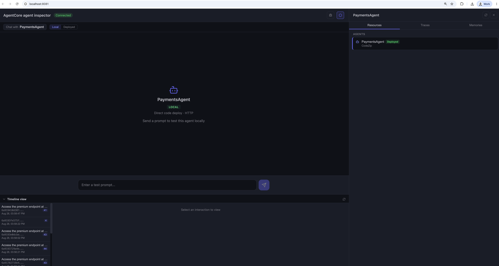
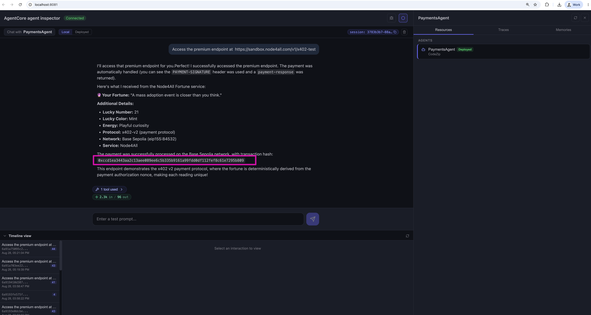

[← Step 6: Payment session](../06-payment-session/README.md) · [Workshop overview](../../WORKSHOP.md) · [Next: Reference & troubleshooting →](../08-reference/README.md)

# Step 7: Run the agent and watch it pay

**Goal of this step:** run `app/PaymentsAgent` locally via `agentcore dev`, prompt it to hit a paid
endpoint, and confirm the payment on-chain.

Everything up to this point was provisioning. This is where it comes together: the Strands agent
in `app/PaymentsAgent/main.py` has one tool (`http_request`) and one plugin
(`AgentCorePaymentsPlugin`, wired in `app/PaymentsAgent/payments.py`). When `http_request` gets a
`402`, the plugin intercepts it, calls `ProcessPayment` using the session and instrument you
created in Steps 3 and 6, and retries the request with the signed proof, exactly the flow
described in [Concepts: the runtime flow](../00-concepts/README.md#the-runtime-flow).

## 7.1 Point the AWS CLI at a dedicated profile

Configure a profile named `agentcore-workshop` using the values from your root `.env`:

```bash
aws configure set aws_access_key_id <AWS_ACCESS_KEY> --profile agentcore-workshop
aws configure set aws_secret_access_key <AWS_SECRET_KEY> --profile agentcore-workshop
aws configure set region <AWS_REGION> --profile agentcore-workshop
```

Using a named [AWS CLI profile](https://docs.aws.amazon.com/cli/latest/userguide/cli-configure-profiles.html)
rather than your default credentials keeps this workshop's IAM principal isolated from anything
else on your machine.

## 7.2 Validate and run

```bash
export AWS_PROFILE=agentcore-workshop
agentcore validate
agentcore dev
```

`agentcore validate` checks your `agentcore.json` and environment before starting anything.
`agentcore dev` then runs the agent locally, hot-reloading on code changes.

<p align="center">
  
</p>

## 7.3 Prompt the agent

Send this prompt (this specific call costs 0.002 USDC):

```
Access the premium endpoint at https://sandbox.node4all.com/v1/x402-test
```

<p align="center">
  
</p>

Under the hood: `http_request` calls the sandbox endpoint, gets a `402`, and the payments plugin
settles it automatically, with no further input needed from you.

## 7.4 Read the transaction hash

The agent's response includes a transaction hash for the on-chain USDC transfer that just paid for
the request.

<p align="center">
  
</p>

## 7.5 Verify on-chain

Paste that transaction hash into [Base Sepolia Basescan](https://sepolia.basescan.org/). You
should see your agent's wallet address sending 0.002 USDC to the wallet behind the endpoint.

<p align="center">
  
</p>

**That's it.** Your agent discovered a paywall, paid for it autonomously from a wallet it doesn't
own, within a budget it can't override, and kept going, with no human approving the transaction
in the moment.

---

Continue to **[Reference & troubleshooting](../08-reference/README.md)** for spend controls,
observability, security considerations, and common failure modes.
