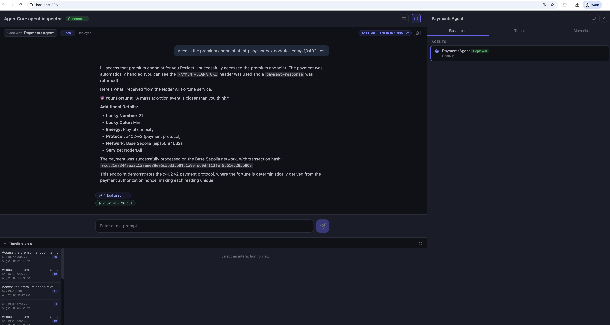
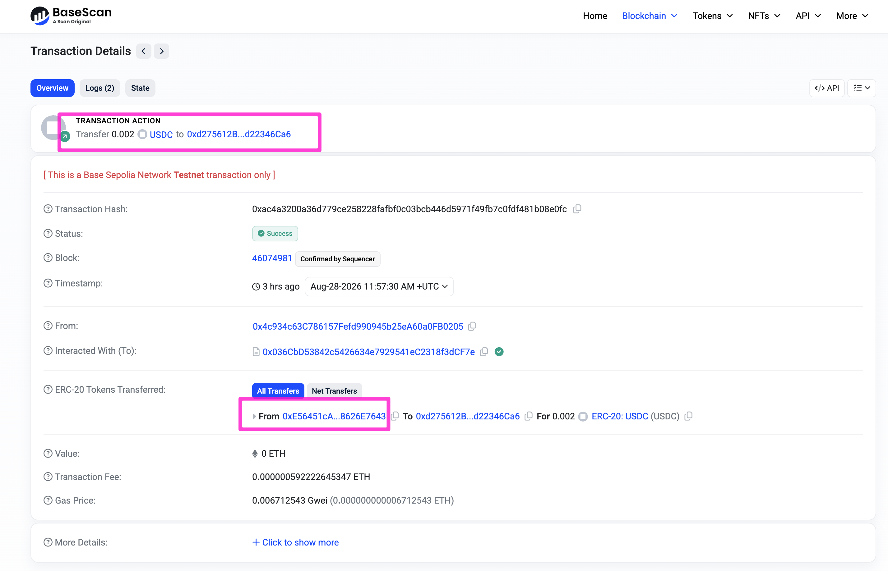

[← Step 9: Create a Payment Session](../09-payment-session/README.md) · [Workshop Overview](../README.md) · [Next: Step 11: Reference & Troubleshooting →](../11-reference/README.md)

# Step 10: Run the agent and watch it pay

**Goal of this step:** run `app/PaymentsAgent` locally via `agentcore dev`, prompt it to call the
paid API you deployed in Step 2, and confirm the payment on-chain and in Stripe.

Everything up to this point was provisioning. This is where it comes together: the Strands agent
in `app/PaymentsAgent/main.py` has one tool (`http_request`) and one plugin
(`AgentCorePaymentsPlugin`, wired in `app/PaymentsAgent/payments.py`). When `http_request` gets a
`402`, the plugin intercepts it, calls `ProcessPayment` using the session and instrument you
created in Steps 6 and 9, and retries the request with the signed proof, exactly the flow
described in [Step 3: the runtime flow](../03-concepts/README.md#the-runtime-flow).

## 9.1 Point the AWS CLI at a dedicated profile

Configure a profile named `agentcore-workshop` using the values from your root `.env`:

```bash
aws configure set aws_access_key_id <AWS_ACCESS_KEY> --profile agentcore-workshop
aws configure set aws_secret_access_key <AWS_SECRET_KEY> --profile agentcore-workshop
aws configure set region <AWS_REGION> --profile agentcore-workshop
```

Using a named [AWS CLI profile](https://docs.aws.amazon.com/cli/latest/userguide/cli-configure-profiles.html)
rather than your default credentials keeps this workshop's IAM principal isolated from anything
else on your machine.

## 9.2 Validate and run

```bash
export AWS_PROFILE=agentcore-workshop
agentcore validate
agentcore dev
```

`agentcore validate` checks your `agentcore.json` and environment before starting anything.
`agentcore dev` then runs the agent locally, hot-reloading on code changes.

<p align="center">
  
</p>

## 9.3 Prompt the agent

Use the full `/content` URL you saved in
[Step 2](../02-paid-api/README.md#16-observe-http-402) and send this prompt. With the workshop's
default `MPP_AMOUNT`, this call costs 0.01 USDC:

```
Access the premium endpoint at https://your-api-id.execute-api.your-aws-region.amazonaws.com/content
```

Replace the example hostname with your deployed API Gateway hostname.

> The reference screenshots below were captured with a 0.002 USDC sample endpoint. Your run uses
> the API you built and its default 0.01 USDC price, so the URL, amount, and recipient will differ.

<p align="center">
  
</p>

Under the hood, `http_request` calls your API and receives the x402 `402` challenge you created.
The payments plugin settles it automatically and retries the request with proof of payment, with
no further input needed from you. The final response should contain your protected API content.

## 9.4 Read the transaction hash

The agent's response includes a transaction hash for the on-chain USDC transfer that just paid for
the request.

<p align="center">
  
</p>

## 9.5 Verify on-chain

Paste that transaction hash into [Base Sepolia Basescan](https://sepolia.basescan.org/). You
should see your agent's wallet address sending 0.01 USDC to the Stripe-managed deposit address
behind your endpoint.

<p align="center">
  
</p>

## 9.6 Verify the payment in Stripe

Open **Payments** in the same Stripe sandbox used by your API's `STRIPE_SECRET_KEY`. The settled
request should appear as a crypto PaymentIntent. The on-chain transaction proves that the USDC
moved; the Stripe payment confirms that the seller side recorded it successfully.

**That's it.** Your agent discovered a paywall, paid for it autonomously from a wallet it doesn't
own, your API returned its protected content, and Stripe recorded the payment—all within a budget
the agent can't override and without a human approving the transaction in the moment.

---

Continue to **[Step 11: Reference & Troubleshooting](../11-reference/README.md)** for spend controls,
observability, security considerations, and common failure modes.
